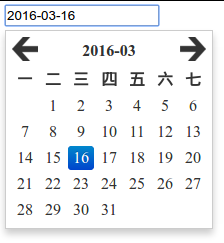

date-picker
===
一个非常简单的日期选择插件

效果
---


例子
---
1. 查看项目目录下的 `sample` 文件夹
2. [jsfiddle示例](https://jsfiddle.net/cqmyg/t8t0teyw/)

用法
---

###引入css

```html
<!-- 注意: 请替换为自己的文件路径 -->
<link rel="stylesheet" href="../css/date-picker.css" type="text/css" charset="utf-8" />

```

###引入javascript

```html
<!-- 注意: 请替换为自己的文件路径 -->
<script src="../bower_components/jquery/dist/jquery.js" type="text/javascript" charset="utf-8"></script>
<script src="../src/date_picker.js" type="text/javascript" charset="utf-8"></script>

```
###调用
```javascript
$("#date_picker").datepicker();
```

编译和测试
---

###搭建环境

######安装 `grunt` 和 `bower`

######克隆项目
```
git clone https://github.com/zhangtasdq/date-picker.git/
```

######下载依赖包
```
// 在项目目录下运行
bower install
npm install
```

######编译
```
grunt
```

######运行测试
```
grunt test
```
